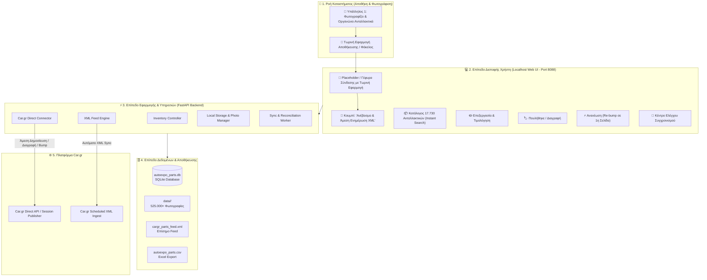
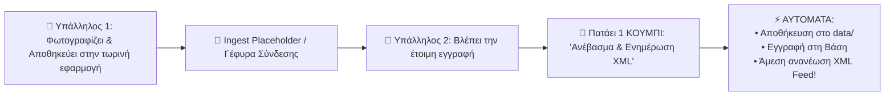

# 🏛️ Αρχιτεκτονική & Προδιαγραφές Εφαρμογής Autoexpo (Localhost Management Suite)
**Πλήρης Τεχνική Σχεδίαση & Λειτουργική Δομή Συστήματος Διαχείρισης Αποθέματος & Car.gr Hub**

---

## 1. 🎯 Σκοπός & Όραμα του Συστήματος (System Purpose)

Η εφαρμογή **Autoexpo Localhost Management Suite** σχεδιάζεται ως το **Κεντρικό Σύστημα Διαχείρισης (ERP & Control Hub)** της Autoexpo:
- **100% Αυτονομία:** Όλες οι καθημερινές λειτουργίες (Καταχώρηση, Επεξεργασία, Αλλαγή Τιμής, Πώληση/Διαγραφή, Ανανέωση/Refresh) εκτελούνται **αποκλειστικά μέσα από το δικό μας Localhost πρόγραμμα** και **ΠΟΤΕ χειροκίνητα από το Car.gr**.
- **Κατάργηση Χειροκίνητης Πληκτρολόγησης:** Γεφυρώνει τη δουλειά του υπαλλήλου που φωτογραφίζει/οργανώνει τα ανταλλακτικά με το Car.gr, αντικαθιστώντας όλη τη χρονοβόρα διαδικασία με **1 Κουμπί Άμεσου Ανεβάσματος & Ενημέρωσης XML**.
- **Άμεση Ενημέρωση (Real-Time Push):** Κάθε ενέργεια στο πρόγραμμα μεταφέρεται στο Car.gr **μέσα σε 2-3 δευτερόλεπτα**.
- **Αμφίδρομη Ασφάλεια (Bidirectional Safety):** Αν υπάρξει οποιαδήποτε εξωτερική αλλαγή, ο έξυπνος **Sync Engine** την εντοπίζει, συμφιλιώνει τα δεδομένα και κρατά το XML Feed 100% ασφαλές και ενημερωμένο.

---

## 2. 🏗️ Συνολική Αρχιτεκτονική Συστήματος (System Architecture Diagram)

---

## 3. 🧩 Ανάλυση Modules & Υποσυστημάτων

---

### 🔌 Module 2: Σύνδεση με Τωρινή Εφαρμογή & 1-Click Ανέβασμα XML (New Part Ingest Bridge)

Αυτό είναι το **κεντρικό σημείο εξοικονόμησης χρόνου** για το κατάστημα:

- **Πώς λειτουργεί:**
  1. **Υπάλληλος 1 (Φωτογράφιση & Οργάνωση):** Φωτογραφίζει το ανταλλακτικό και το αποθηκεύει οργανωμένο στην τρέχουσα εφαρμογή/φάκελο αποθήκης.
  2. **Placeholder / Γέφυρα Σύνδεσης:** Το σύστημά μας «ακούει» και διαβάζει απευθείας τα έτοιμα δεδομένα & τις φωτογραφίες από την τωρινή εφαρμογή.
  3. **Υπάλληλος 2 (Ανέβασμα χωρίς πληκτρολόγηση):** Αντί να κάθεται να γράφει χειροκίνητα στο Car.gr για 5 λεπτά, πατάει **απλά 1 κουμπί: «🚀 Ανέβασμα & Άμεση Ενημέρωση XML»**!
  4. **Αυτόματη Εκτέλεση σε 1 δευτερόλεπτο:**
     - Αποθηκεύονται οι φωτογραφίες στο `data/<id>/`.
     - Καταχωρείται η εγγραφή στη βάση SQLite.
     - **Προστίθεται αμέσως στο `cargr_parts_feed.xml`** και ανανεώνεται το timestamp.
     - Γλιτώνετε 100% τη χειροκίνητη πληκτρολόγηση στο Car.gr!

---

### 📦 Module 1: Κατάλογος & Αναζήτηση Ανταλλακτικών (Inventory Explorer)
- **Αστραπιαία Αναζήτηση:** Αναζήτηση σε <10ms ανάμεσα στις 17.730 αγγελίες βάσει:
  - Κωδικού ID / `unique_id` / Barcode / Ραφιού
  - Τίτλου ανταλλακτικού & OEM Part Numbers
  - Μάρκας & Μοντέλου αυτοκινήτου
  - Εύρους τιμών (€)
  - Κατάστασης (Ενεργό / Πουλήθηκε / Σε εκκρεμότητα)
- **Μαζικές Ενέργειες (Bulk Actions):**
  - Μαζική αλλαγή τιμών (π.χ. -10% σε επιλεγμένα ανταλλακτικά).
  - Μαζική αλλαγή κατάστασης.

---

### ✏️ Module 3: Επεξεργασία & Αλλαγή Τιμών (Instant Price & Detail Updater)
- Αλλαγή τιμής με 1 κλικ (π.χ. από 150€ σε 120€).
- Το backend στέλνει άμεση ενημέρωση στο Car.gr και ανανεώνει την τιμή στη βάση δεδομένων και στο XML Feed.

---

### 🏷️ Module 4: Πώληση & Διαγραφή Ανταλλακτικού (Mark Sold / Delete Engine)
- **Κουμπί «✅ Πουλήθηκε / Αρχειοθέτηση»:**
  1. Σημειώνει το ανταλλακτικό ως `is_active = 0` (Πουλημένο) στη βάση δεδομένων.
  2. Στέλνει άμεση εντολή στο Car.gr για διαγραφή/αρχειοθέτηση της αγγελίας.
  3. **Αφαιρεί αυτόματα την αγγελία από το `cargr_parts_feed.xml`** (ώστε να μην ξανανέβει ποτέ κατά λάθος).
  4. Διατηρεί το ιστορικό πώλησης για στατιστικά και λογιστήριο.

---

### ⚡ Module 5: Ανανέωση Αγγελιών / Re-bump (Refresh to Page 1)
- **Κουμπί «🚀 Ανανέωση στο Car.gr»:**
  - Το σύστημα στέλνει εντολή ανανέωσης (bump) στο Car.gr.
  - Η αγγελία ανεβαίνει αυτόματα **πρώτη στην 1η σελίδα αναζήτησης του Car.gr**!
  - Δυνατότητα προγραμματισμένης αυτόματης ανανέωσης (π.χ. ανανέωση 50 τυχαίων ανταλλακτικών κάθε πρωί).

---

### 🔄 Module 6: Κέντρο Συγχρονισμού & Watcher (Sync & Reconciliation Hub)
- **Πίνακας Ελέγχου (Sync Dashboard):**
  - Ζωντανή ένδειξη κατάστασης σύνδεσης με Car.gr.
  - Ώρα τελευταίου συγχρονισμού & κατάσταση του XML Feed.
  - Ειδοποίηση αν εντοπιστεί οποιαδήποτε εξωτερική αλλαγή.
- **Κουμπί «🔄 Άμεσος Συγχρονισμός Τώρα»:**
  - Σαρώνει το Car.gr, κατεβάζει τυχόν νέες χειροκίνητες αγγελίες και φωτογραφίες, και ενημερώνει το XML.
- **Κουμπί «🛡️ Έλεγχος Ακεραιότητας 20 Σημείων»:**
  - Εκτελεί το `full_pipeline_validator` απευθείας μέσα από το γραφικό περιβάλλον και εμφανίζει την αναφορά με πράσινα checks.

---

## 4. 🛠️ Τεχνολογική Στοίβα (Tech Stack)

| Επίπεδο | Τεχνολογία | Περιγραφή |
| :--- | :--- | :--- |
| **Backend Framework** | **FastAPI (Python 3.12)** | Υπερταχύ ασύγχρονο web framework με αυτόματο API documentation (Swagger). |
| **Database** | **SQLite (WAL Mode)** | Τοπική βάση υψηλής αξιοπιστίας με υποστήριξη παράλληλων συνδέσεων. |
| **Frontend UI** | **HTML5 / Modern JS / Tailwind CSS** | Ελαφρύ, ταχύτατο περιβάλλον χωρίς βαριές εξαρτήσεις, ιδανικό για desktop & tablet. |
| **Automation Engine**| **curl_cffi / Playwright** | Ασφαλής σύνδεση και άμεση δημοσίευση στο Car.gr. |
| **XML Processing** | **xml.etree.ElementTree (C-Optimized)** | Ταχύτατη παραγωγή και έλεγχος των 56 MB XML σε < 1 δευτερόλεπτο. |
| **Data Storage** | **Local File System (`data/`)** | Οργανωμένη αποθήκευση 105 GB φωτογραφιών με μηδενικό κόστος cloud. |

---

## 5. 📅 Στάδια Υλοποίησης (Implementation Milestones)

- [ ] **Milestone 1: Ingest Bridge & Backend Handlers (Ημέρα 1 - Πρωί):**
  - Ανάπτυξη Placeholder σύνδεσης με την τωρινή εφαρμογή αποθήκευσης/φωτογράφισης.
  - Αυτόματο 1-click Ingest & γρήγορη ανανέωση του XML feed.
- [ ] **Milestone 2: Bidirectional Sync & Background Watcher (Ημέρα 1 - Απόγευμα):**
  - Αυτόματος εντοπισμός εξωτερικών αλλαγών.
  - Αυτόματη αφαίρεση πουλημένων και προσθήκη νέων στο XML.
  - Δημιουργία `sync.bat` για άμεση εκτέλεση.
- [ ] **Milestone 3: Modern Web UI (Ημέρα 2 - Πρωί):**
  - Κατάλογος με Live Search, Φίλτρα, Κουμπί «Ανέβασμα & Ενημέρωση XML», Κουμπιά Πώλησης & Ανανέωσης.
- [ ] **Milestone 4: Car.gr Direct Publisher & Final Testing (Ημέρα 2 - Απόγευμα):**
  - Direct Session API για άμεση δημοσίευση σε 2 δευτερόλεπτα.
  - Τελικός έλεγχος 20 σημείων και παράδοση.
