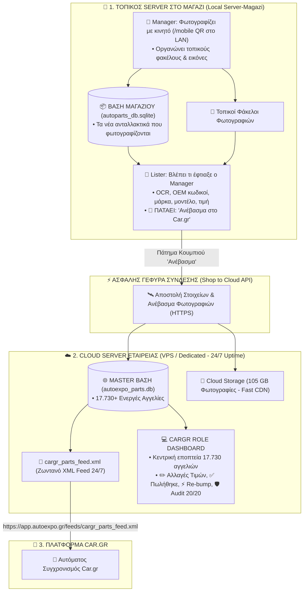

# 🏛️ Πλήρης Υβριδική Αρχιτεκτονική: Local Shop Server ➡️ Cloud Server ➡️ Car.gr
**Η Ακριβής Τοπολογία Συστημάτων, Βάσεων Δεδομένων & Ρόλων της Autoexpo**

---

## 1. 🌐 Το Συνολικό Διάγραμμα Υβριδικής Αρχιτεκτονικής (Hybrid Cloud Topology)



---

## 2. 📍 Πού Βρίσκεται το Κάθε Στοιχείο & Πώς Διαχωρίζονται οι 2 Βάσεις:

---

### 🏬 Α. ΣΤΟΝ ΤΟΠΙΚΟ SERVER ΤΟΥ ΜΑΓΑΖΙΟΥ (`server-magazi`):
Είναι ο υπολογιστής μέσα στο κατάστημα που εξυπηρετεί τη φυσική φωτογράφιση και απογραφή:
1. **Η Τοπική Βάση του Μαγαζιού (`autoparts_db.sqlite`):**  
   Κρατάει αποκλειστικά τα **νέα εισερχόμενα ανταλλακτικά** που φωτογραφίζονται στο ράφι.
2. **Οι Τοπικές Φωτογραφίες:**  
   Οι αρχικοί φάκελοι φωτογραφιών που ανεβάζει ο Manager από το κινητό του μέσω `/mobile`.
3. **Ο Ρόλος `manager`:**  
   Φωτογραφίζει με το κινητό και οργανώνει τα πακέτα φωτογραφιών.
4. **Ο Ρόλος `lister`:**  
   Βλέπει τις νέες φωτογραφίες στον τοπικό server, συμπληρώνει τους κωδικούς (OCR), το αυτοκίνητο, την τιμή και πατάει:  
   👉 **`[🚀 Ανέβασμα στο Car.gr]`**!

---

### ☁️ Β. ΣΤΟΝ CLOUD SERVER (VPS / Dedicated Cloud - 24/7):
Είναι ο κεντρικός εξωτερικός server στο internet που φιλοξενεί όλο το ζωντανό κατάστημα:
1. **Η Master Βάση Car.gr (`autoexpo_parts.db` - 213 MB):**  
   Περιέχει **και τις 17.730+ ενεργές αγγελίες** του καταστήματος με όλες τις λεπτομέρειες.
2. **Το Cloud Storage Φωτογραφιών (105.65 GB):**  
   Φιλοξενεί όλες τις 525.290 φωτογραφίες και τις σερβίρει με μέγιστη ταχύτητα μέσω HTTPS/CDN.
3. **Το Ζωντανό Car.gr XML Feed (`cargr_parts_feed.xml`):**  
   Σερβίρεται 24/7/365 απευθείας στο Car.gr (`https://app.autoexpo.gr/feeds/cargr_parts_feed.xml`).
4. **Ο Ρόλος `cargr` (XML Control Dashboard):**  
   Το κεντρικό dashboard στο cloud όπου γίνονται οι αλλαγές τιμών, τα μαρκαρίσματα πωλήσεων (`Πουλήθηκε`), τα re-bumps στην 1η σελίδα και οι έλεγχοι ακεραιότητας 20 σημείων!

---

## 3. 🚀 Η Ροή Ενός Νέου Ανταλλακτικού (Από το Ράφι στο Car.gr):

```
1. [ΜΑΓΑΖΙ] Manager φωτογραφίζει στο ράφι με κινητό (/mobile QR)
       │
       ▼
2. [ΜΑΓΑΖΙ] Lister ανοίγει την τοπική οθόνη, συμπληρώνει OEM & Τιμή
       │
       ▼
3. [ΜΑΓΑΖΙ] Lister πατάει "🚀 Ανέβασμα στο Car.gr"
       │
       ▼ (Ασφαλές HTTPS API Call στο Cloud)
4. [CLOUD]  Cloud Server παραλαμβάνει στοιχεία & φωτογραφίες
       │
       ├─► Αποθηκεύει στη Master Βάση (autoexpo_parts.db)
       ├─► Αποθηκεύει φωτογραφίες στο Cloud Storage (data/)
       ├─► Προσθέτει το <classified> στο cargr_parts_feed.xml
       │
       ▼
5. [CAR.GR] Το Car.gr διαβάζει το ανανεωμένο XML και η αγγελία είναι live!
```

---

## 4. 📅 Πλάνο Υλοποίησης (2 Ημέρες):

| Στάδιο | Αντικείμενο Εργασίας | Χρόνος |
| :--- | :--- | :---: |
| **Milestone 1** | **Cloud Server API & Master Database Handler:**<br>• Endpoints στο Cloud για υποδοχή νέων ανταλλακτικών & φωτογραφιών από το μαγαζί.<br>• Αυτόματη ανανέωση του `cargr_parts_feed.xml`. | **Ημέρα 1 (Πρωί)** |
| **Milestone 2** | **Shop Client Ingest Button:**<br>• Σύνδεση του κουμπιού «Ανέβασμα» στον τοπικό server του μαγαζιού με το Cloud API. | **Ημέρα 1 (Απόγευμα)** |
| **Milestone 3** | **Cargr Role Dashboard (Cloud UI):**<br>• Οθόνη διαχείρισης 17.730 αγγελιών, αλλαγές τιμών, κουμπιά «Πουλήθηκε», «Re-bump» & 20/20 Audit. | **Ημέρα 2 (Πρωί)** |
| **Milestone 4** | **Τελικός Έλεγχος & Cloud Deployment:**<br>• Δοκιμή ανέβασματος από το μαγαζί στο Cloud και επικύρωση XML Feed. | **Ημέρα 2 (Απόγευμα)** |
