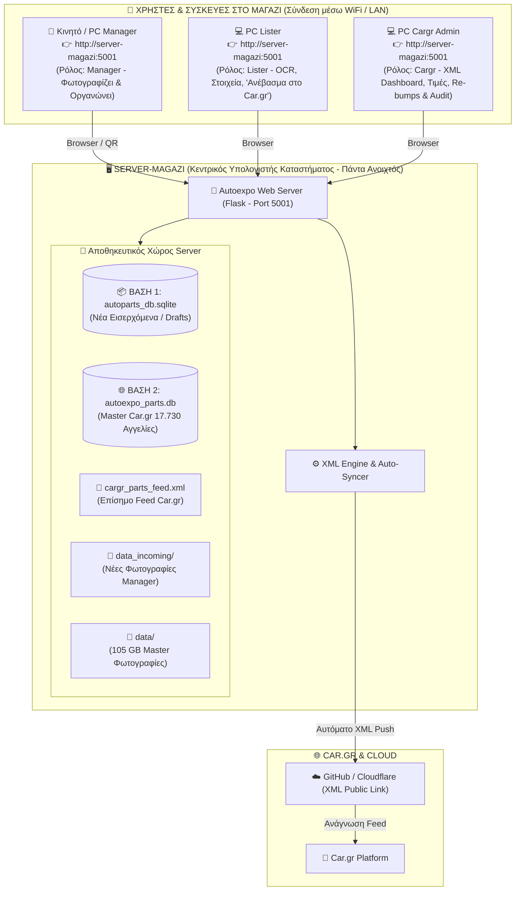

# 🖥️ Φυσική Αρχιτεκτονική & Ανάπτυξη σε Επίπεδο Υπολογιστών (PC-Level Deployment)
**Πού τρέχει τι, πού αποθηκεύονται οι βάσεις, οι φωτογραφίες και το XML Feed στο κατάστημα Autoexpo**

---

## 1. 🏗️ Συνολικό Διάγραμμα Δικτύου Καταστήματος (Shop LAN Topology)

---

## 2. 📍 Πού Βρίσκεται το Κάθε Στοιχείο (Hardware & Storage Breakdown)

### 🖥️ Στον `server-magazi` (Κεντρικό Μηχάνημα):
Ο `server-magazi` είναι το **μοναδικό κεντρικό μηχάνημα** που φιλοξενεί τα δεδομένα και εκτελεί την εφαρμογή:

1. **Η Web Εφαρμογή (Flask Server - Port 5001):**  
   Τρέχει τοπικά και εξυπηρετεί όλους τους χρήστες του καταστήματος μέσω του εσωτερικού δικτύου (`http://server-magazi:5001` ή `http://192.168.x.x:5001`).
2. **Βάση 1 (`autoparts_db.sqlite`):**  
   Κρατάει τα νέα εισερχόμενα ανταλλακτικά που φωτογραφίζει ο Manager.
3. **Βάση 2 (`autoexpo_parts.db` - 213 MB):**  
   Κρατάει το **Master Αρχείο και των 17.730 ενεργών ανταλλακτικών** του μαγαζιού.
4. **Φάκελος Φωτογραφιών (`data/` - 105.65 GB):**  
   Όλες οι 525.290 φωτογραφίες των ανταλλακτικών αποθηκευμένες οργανωμένα σε σκληρό δίσκο του server.
5. **Car.gr XML Feed (`cargr_parts_feed.xml` - 56.2 MB):**  
   Παράγεται και ανανεώνεται τοπικά στον server και συγχρονίζεται αυτόματα με το δημόσιο endpoint (GitHub / Cloudflare).

---

### 💻 Στους Υπολογιστές-Clients (Manager, Lister, Cargr Admin):
- **Μηδενική Εγκατάσταση:** Στα υπόλοιπα PC και κινητά **ΔΕΝ εγκαθίσταται τίποτα** (ούτε Python, ούτε βάσεις, ούτε βιβλιοθήκες).
- **Πρόσβαση:** Ανοίγουν απλά τον Browser (Chrome / Edge / Safari) ή το εγκατεστημένο PWA εικονίδιο:  
  👉 **`http://server-magazi:5001`** (ή `http://autoparts.local:5001`).
- **Σύνδεση:** Κάνουν Login με το Username τους και επιλέγουν τον ρόλο τους (`manager`, `lister`, ή `cargr`).

---

## 3. 🚀 Γιατί Αυτή η Δομή είναι η Ιδανική για το Μαγαζί:

1. **Αστραπιαία Ταχύτητα (Local Zero-Latency):**  
   Όταν ο Lister πατάει «Ανέβασμα στο Car.gr», η μεταφορά δεδομένων από τη Βάση 1 στη Βάση 2 και η ενημέρωση του XML γίνεται **τοπικά στον server σε 0.02 δευτερόλεπτα**, χωρίς να επιβαρύνεται το δίκτυο WiFi!
2. **Μηδενικός Κίνδυνος Απώλειας Δεδομένων:**  
   Όλα τα backups (`autoexpo_parts.db`, `autoparts_db.sqlite` και φωτογραφίες) γίνονται κεντρικά στον server-magazi.
3. **Ελευθερία Κινήσεων:**  
   Ο Manager φωτογραφίζει με το κινητό στην αποθήκη, ο Lister δουλεύει στο δικό του γραφείο και ο Cargr admin στο δικό του — όλοι βλέπουν τα ίδια δεδομένα σε πραγματικό χρόνο!
