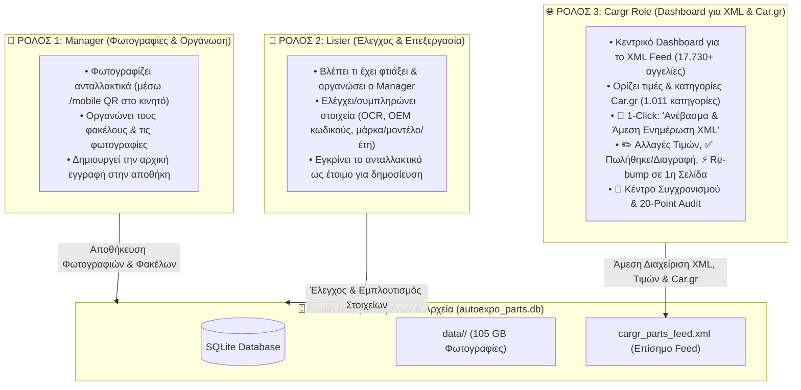

# 🏛️ Πλήρες Σχέδιο Ενοποίησης: AutoParts Manager & Car.gr Hub (3-Role Architecture)
**Ακριβής Αρχιτεκτονική των 3 Ρόλων της Autoexpo**

---

## 1. 👥 Οι 3 Ακριβείς Ρόλοι του Συστήματος (Exact 3-Role Workflow)

---

## 2. 🧩 Αναλυτική Λειτουργία Ανά Ρόλο

---

### 📸 1. Ρόλος `manager` (Φωτογράφιση & Οργάνωση):
- **Κύριο Καθήκον:** Η φυσική φωτογράφιση και η οργάνωση του ανταλλακτικού.
- **Εργαλεία:**
  - Σύνδεση κινητού μέσω **QR Code (`/mobile`)** απευθείας στο ράφι.
  - Drag & Drop φωτογραφιών από τον υπολογιστή.
  - Αυτόματη δημιουργία και οργάνωση του φακέλου εικόνων (`data/<id>/`).
  - Δημιουργεί την αρχική εγγραφή του ανταλλακτικού στην αποθήκη.

---

### 📝 2. Ρόλος `lister` (Έλεγχος & Επεξεργασία):
- **Κύριο Καθήκον:** Ελέγχει τι έφτιαξε ο Manager και προετοιμάζει τα τεχνικά στοιχεία.
- **Εργαλεία:**
  - Βλέπει τη λίστα με τα ανταλλακτικά που φωτογράφισε ο Manager.
  - Χρήση **Tesseract OCR** για αυτόματη ανάγνωση κωδικών OEM από τις φωτογραφίες.
  - Επιλογή Μάρκας, Μοντέλου και Εύρους Χρονολογιών (π.χ. `2019-->`).
  - Συμπλήρωση περιγραφής και κατάστασης (Γνήσιο, Μεταχειρισμένο κλπ.).
  - Μαρκάρει το ανταλλακτικό ως **«Έτοιμο για Car.gr»**.

---

### 🌐 3. Ρόλος `cargr` (Το Car.gr & XML Dashboard):
- **Κύριο Καθήκον:** Ο πλήρης έλεγχος του XML Feed, των τιμών και του Car.gr.
- **Εργαλεία στο Dashboard:**
  1. **Καρτέλα «Έτοιμα για Car.gr»:**
     - Βλέπει τα εγκεκριμένα ανταλλακτικά του Lister.
     - Ορίζει Τιμή (€) και Car.gr Κατηγορία (από τις 1.011 επίσημες).
     - **Πατάει 1 Κουμπί: `[🚀 Ανέβασμα & Άμεση Ενημέρωση XML]`**:
       - Προστίθεται αμέσως στο `cargr_parts_feed.xml`.
       - Ενημερώνεται η ώρα `<lastupdate>`.
  2. **Καρτέλα «Ενεργές Αγγελίες (17.730)»:**
     - **`[✏️ Αλλαγή Τιμής]`**: Αλλάζει άμεσα την τιμή στο XML feed.
     - **`[✅ Πουλήθηκε / Διαγραφή]`**: Αφαιρεί άμεσα το ανταλλακτικό από το XML feed ώστε να μην ξανανέβει.
     - **`[⚡ Re-bump / Ανανέωση]`**: Στέλνει εντολή ανανέωσης για να ανέβει η αγγελία στην 1η σελίδα του Car.gr.
  3. **Καρτέλα «Συγχρονισμός & Audit»:**
     - Ζωντανή ένδειξη κατάστασης του XML Feed.
     - Εκτέλεση του **Ελέγχου Ακεραιότητας 20 Σημείων** (`python main.py audit`) με 1 κλικ!

---

## 3. 📅 Πλάνο Υλοποίησης (2 Ημέρες)

| Στάδιο | Περιγραφή | Χρόνος |
| :--- | :--- | :---: |
| **Βήμα 1** | **Προσθήκη Ρόλου `cargr` στο `users.py`:** • Ρύθμιση login και permissions για τους 3 ρόλους (`manager`, `lister`, `cargr`). | **Ημέρα 1 (Πρωί)** |
| **Βήμα 2** | **Backend XML Engine & Κατηγορίες:** • Σύνδεση της φόρμας Car.gr με τις 1.011 κατηγορίες και τον `cargr_xml_generator.py`. | **Ημέρα 1 (Απόγευμα)** |
| **Βήμα 3** | **UI Car.gr Dashboard:** • Σχεδίαση της οθόνης για τον ρόλο `cargr` (Ουρά έτοιμων, αλλαγές τιμών, κουμπιά «Πουλήθηκε» & «Re-bump»). | **Ημέρα 2 (Πρωί)** |
| **Βήμα 4** | **Τελική Ενοποίηση & Δοκιμή:** • Δοκιμή πλήρους ροής: Manager (Φωτό) ➡️ Lister (Στοιχεία) ➡️ Cargr (1-Click XML Upload) ➡️ Έλεγχος 20/20. | **Ημέρα 2 (Απόγευμα)** |
