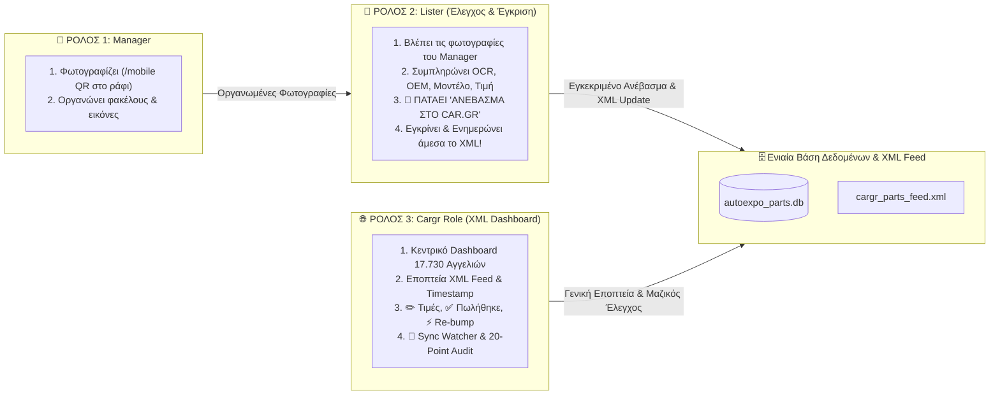

# 🏛️ Πλήρες Σχέδιο Ενοποίησης: AutoParts Manager & Car.gr Hub (3-Role Architecture)
**Ακριβής Αρχιτεκτονική των 3 Ρόλων της Autoexpo**

---

## 1. 👥 Οι 3 Ακριβείς Ρόλοι & Η Ροή Έγκρισης (Approval & Publish Workflow)

---

## 2. 📋 Αναλυτική Ροή Ανά Ρόλο

---

### 📸 1. Ρόλος `manager` (Φωτογράφιση & Οργάνωση):
- **Καθήκον:** Η φυσική φωτογράφιση του ανταλλακτικού και η τακτοποίηση των εικόνων.
- **Πώς λειτουργεί:**
  - Σύνδεση κινητού μέσω **QR Code (`/mobile`)** απευθείας στο ράφι.
  - Αυτόματη δημιουργία και οργάνωση του φακέλου εικόνων (`data/<id>/`).
  - Παραδίδει το έτοιμο πακέτο φωτογραφιών στην ουρά του Lister.

---

### 📝 2. Ρόλος `lister` (Έλεγχος, Τιμολόγηση & Έγκριση Ανεβάσματος):
- **Καθήκον:** Ο ουσιαστικός έλεγχος (εποπτεία) και η τελική έγκριση δημοσίευσης.
- **Πώς λειτουργεί:**
  1. Ανοίγει την οθόνη του και βλέπει τις νέες φωτογραφίες που οργάνωσε ο Manager.
  2. Χρησιμοποιεί το **OCR** για αυτόματη ανάγνωση κωδικών OEM, επιλέγει Μάρκα, Μοντέλο, Έτη, Κατηγορία Car.gr και ορίζει την Τιμή (€).
  3. **Πατάει το κουμπί: `[🚀 Ανέβασμα στο Car.gr & Ενημέρωση XML]`**:
     - **Με την εποπτεία και την έγκρισή του**, το ανταλλακτικό:
       - Εισάγεται αυτόματα στη βάση δεδομένων (`autoexpo_parts.db`).
       - **Προστίθεται αμέσως στο `cargr_parts_feed.xml`** και ανανεώνεται το timestamp `<lastupdate>`.
       - Δημοσιεύεται ζωντανά στο Car.gr χωρίς καμία άλλη χειροκίνητη ενέργεια!

---

### 🌐 3. Ρόλος `cargr` (Το Car.gr & XML Control Dashboard):
- **Καθήκον:** Το γενικό κέντρο ελέγχου για ολόκληρο το κατάστημα (17.730 αγγελίες).
- **Πώς λειτουργεί:**
  - **Πλήρης Εποπτεία XML Feed:** Κατάσταση αρχείου, ημερομηνία τελευταίου συγχρονισμού Car.gr, πλήθος ενεργών αγγελιών.
  - **`[✏️ Αλλαγή Τιμής]`**: Άμεση ανανέωση τιμών στο XML.
  - **`[✅ Πουλήθηκε / Διαγραφή]`**: Άμεση αφαίρεση πουλημένων ανταλλακτικών από το XML feed.
  - **`[⚡ Re-bump / Ανανέωση]`**: Εντολή για άνοδο αγγελιών στην 1η σελίδα του Car.gr.
  - **`[🛡️ 20-Point Audit Tool]`**: Πλήρης έλεγχος ακεραιότητας 20 σημείων με 1 κλικ.

---

## 3. 📅 Πλάνο Υλοποίησης (2 Ημέρες)

| Στάδιο | Περιγραφή | Χρόνος |
| :--- | :--- | :---: |
| **Βήμα 1** | **Ρόλοι & Σύνδεση Login:** Προσθήκη δικαιωμάτων στους 3 ρόλους (`manager`, `lister`, `cargr`) στο `users.py`. | **Ημέρα 1 (Πρωί)** |
| **Βήμα 2** | **Κουμπί Έγκρισης Lister & XML Engine:** Σύνδεση του κουμπιού «Ανέβασμα στο Car.gr» στην οθόνη του Lister με τον αυτόματο `cargr_xml_generator.py`. | **Ημέρα 1 (Απόγευμα)** |
| **Βήμα 3** | **Cargr Role Dashboard:** Οθόνη εποπτείας XML, αλλαγών τιμών, κουμπιών «Πουλήθηκε», «Re-bump» και 20-Point Audit. | **Ημέρα 2 (Πρωί)** |
| **Βήμα 4** | **Τελική Ενοποίηση & Δοκιμή:** Δοκιμή της πλήρους αλυσίδας: Manager (Φωτό) ➡️ Lister (Έγκριση & 1-Click XML Upload) ➡️ Cargr Hub (Εποπτεία). | **Ημέρα 2 (Απόγευμα)** |
