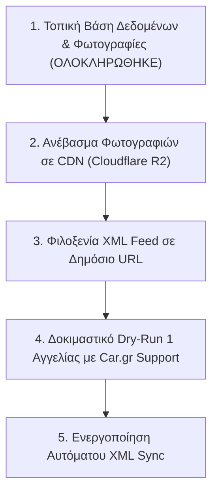

# 🚀 Autoexpo Car.gr Pipeline & XML Feed Integration
**Ολοκληρωμένη Τεχνική Τεκμηρίωση & Προδιαγραφές Συστήματος**

---

## 1. 📌 Επισκόπηση Έργου (Executive Summary)

Το σύστημα **Autoexpo Car.gr Pipeline** αναπτύχθηκε για να προσφέρει **πλήρη ανεξαρτησία, αυτοματοποίηση και συγχρονισμό** του αποθέματος ανταλλακτικών της εταιρείας **Autoexpo** με την πλατφόρμα του **Car.gr** μέσω του επίσημου προτύπου **XML Feed (`xyma-parts`)**.

### 📊 Βασικά Μεγέθη Καταλόγου:
- **Συνολικές Αγγελίες:** `17.730`
- **Πληρότητα Περιγραφών:** `100.0%` (0 κομμένα κείμενα)
- **Αποθηκευμένες Φωτογραφίες Τοπικά:** `525.290` αρχεία High-Res (`105.65 GB`)
- **Μοναδικότητα Δεδομένων:** `100% Zero-Duplicates` (17.730 μοναδικά IDs)
- **Εγκυρότητα XML Feed:** `100% Validated` από τον Επίσημο Ελεγκτή του Car.gr

---

## 2. 🏗️ Αρχιτεκτονική & Δομή Συστήματος

```
Cargr_autoexpo_sync/
├── database/
│   ├── autoexpo_parts.db       # SQLite Single Source of Truth (213 MB)
│   ├── autoexpo_parts.csv      # Πλήρης εξαγωγή σε Excel (43 MB)
│   ├── autoexpo_parts.json     # Πλήρης εξαγωγή σε JSON (250 MB)
│   └── cargr_parts_feed.xml    # Επίσημο Car.gr XML Feed (51 MB)
├── data/                       # Φάκελοι φωτογραφιών ανά αγγελία (105 GB)
│   ├── 344340392/              # ID Αγγελίας
│   │   ├── 0.jpg               # 1η φωτογραφία
│   │   ├── 1.jpg               # 2η φωτογραφία
│   │   └── ...
├── scripts/
│   ├── database.py             # SQLite Schema & Thread-safe queries
│   ├── scraper.py              # Parallel catalog extraction & Rate-limit handling
│   ├── reconstruct_descriptions.py # Smart auto-fill for truncated descriptions
│   ├── image_downloader.py     # Asynchronous High-Res Image Downloader (40 workers)
│   ├── cargr_xml_generator.py  # Car.gr XML generator & schema validator
│   ├── sync_diff.py            # Fast incremental sync & audit engine
│   ├── viewer_app.py           # Local Web Dashboard (FastAPI/HTML)
│   └── exporter.py             # CSV / JSON multi-format exporter
├── main.py                     # Κεντρικό CLI Interface
├── requirements.txt            # Python Dependencies
├── .gitignore                  # Production-ready Git exclusions
└── PROJECT_DOCUMENTATION.md    # Πλήρης Τεχνική Τεκμηρίωση
```

---

## 3. 🌐 Τεχνικές Προδιαγραφές Car.gr XML Feed (`xyma-parts`)

Το XML Feed παράγεται σύμφωνα με το επίσημο documentation του **Car.gr (`car.gr/xmldoc/xyma-parts`)**.

### 📐 Δομή XML Δέντρου (XML Schema):

```xml
<?xml version="1.0" encoding="utf-8"?>
<cardealer>
    <lastupdate>2026-08-19T11:50:54Z</lastupdate>
    <classifieds>
        <classified>
            <unique_id>344340392</unique_id>
            <title>ΑΚΡΑ ΑΡΙΣΤΕΡΟ &amp; ΔΕΞΙ ΜΕ ΑΜΟΡΤΙΣΕΡ FORD PUMA 19--&gt; B7JB 1.0 ΒΕΝΖΙΝΗ</title>
            <description>ΑΚΡΑ ΑΡΙΣΤΕΡΟ ΚΑΙ ΔΕΞΙ ΜΕ ΑΜΟΡΤΙΣΕΡ FORD PUMA 19--&gt; B7JB 1.0 ΒΕΝΖΙΝΗ. ΡΩΤΗΣΤΕ ΜΑΣ ΓΙΑ ΟΤΙ ΣΑΣ ΕΝΔΙΑΦΕΡΕΙ.</description>
            <category_id>305</category_id>
            <price>5.00</price>
            <condition>used</condition>
            <manufacturer_number>B7JB</manufacturer_number>
            <makemodels>
                <makemodel>
                    <make>Ford</make>
                    <model>Puma</model>
                    <year_from>2019</year_from>
                    <year_to></year_to>
                </makemodel>
            </makemodels>
            <photos>
                <photo>https://static.car.gr/344340392_0_b.jpg</photo>
                <photo>https://static.car.gr/344340392_1_b.jpg</photo>
            </photos>
        </classified>
    </classifieds>
</cardealer>
```

### 📋 Ανάλυση Πεδίων & Κανόνες Car.gr:

| Πεδίο XML | Τύπος | Υποχρεωτικό | Περιγραφή & Κανόνας Εγκυρότητας |
| :--- | :--- | :---: | :--- |
| `<lastupdate>` | ISO 8601 UTC | **ΝΑΙ** | Ημερομηνία και ώρα παραγωγής του αρχείου (π.χ. `2026-08-19T11:50:54Z`). |
| `<unique_id>` | String | **ΝΑΙ** | **Ο Εσωτερικός Κωδικός Καταστήματος**. Αντιστοιχίζεται 1-προς-1 με το ID της αγγελίας στο Car.gr για αποφυγή διπλότυπων. |
| `<title>` | String | **ΝΑΙ** | Τίτλος του ανταλλακτικού. Γίνεται αυτόματο XML entity escaping (`&` -> `&amp;`, `<` -> `&lt;`). |
| `<description>` | Text | **ΝΑΙ** | Πλήρης περιγραφή του ανταλλακτικού (100% ολοκληρωμένο κείμενο χωρίς αποσιωπητικά). |
| `<category_id>` | Integer | **ΝΑΙ** | **Αυστηρά 1 leaf ID κατηγορίας** (το βαθύτερο ID του δέντρου Car.gr). *Σφάλμα αν μπουν πολλαπλά.* |
| `<price>` | Decimal | Όχι | Τιμή σε Ευρώ με 2 δεκαδικά (π.χ. `150.00`). Αν είναι "Ρωτήστε τιμή", το πεδίο παραλείπεται. |
| `<condition>` | Enum | **ΝΑΙ** | `used` (Μεταχειρισμένο) ή `new` (Καινούργιο). |
| `<manufacturer_number>` | String | Όχι | Εργοστασιακός κωδικός κατασκευαστή (OEM Part Number). |
| `<aftermarket_number>` | String | Όχι | Aftermarket κωδικός ανταλλακτικού. |
| `<makemodels>` | Tree | Όχι | Λίστα συμβατών οχημάτων με `<make>`, `<model>`, `<year_from>`, `<year_to>`. |
| `<photos>` | Tree | **ΝΑΙ** | Λίστα πλήρων URLs των φωτογραφιών του ανταλλακτικού (`<photo>`). |

---

## 4. 💻 Οδηγός Εντολών (CLI Reference)

Όλες οι λειτουργίες εκτελούνται από το κεντρικό αρχείο [`main.py`](file:///c:/Users/kioan/OneDrive/stauro%20poutana/Cargr_autoexpo_sync/Cargr_autoexpo_sync/main.py):

### 1. Προβολή Στατιστικών Βάσης:
```powershell
python main.py stats
```

### 2. Γρήγορος Έλεγχος Συγχρονισμού & Διαφορών (Sync):
```powershell
python main.py sync
```
*Ελέγχει τον ζωντανό κατάλογο του Car.gr, βρίσκει τυχόν νέες αγγελίες ή αγγελίες που πουλήθηκαν, και ενημερώνει τη βάση δεδομένων.*

### 3. Λήψη Όλων των Φωτογραφιών (High-Res):
```powershell
python main.py download-images --concurrency 40
```
*Κατεβάζει ασύγχρονα όλες τις φωτογραφίες σε μέγιστη ανάλυση στο φάκελο `data/<listing_id>/`.*

### 4. Εξαγωγή Επίσημου Car.gr XML Feed:
```powershell
python main.py export-xml
```
*Δημιουργεί το αρχείο `database/cargr_parts_feed.xml`.*

### 5. Έλεγχος Εγκυρότητας XML Feed (Validator):
```powershell
python main.py validate-xml
```
*Ελέγχει αν το αρχείο XML πληροί 100% τις προδιαγραφές του Car.gr.*

### 6. Εξαγωγή σε Excel (CSV) και JSON:
```powershell
python main.py export
```

### 7. Εκκίνηση Τοπικού Web Dashboard (Visual Inspection):
```powershell
python main.py viewer
```
*Ανοίγει το διαδραστικό dashboard στη διεύθυνση `http://localhost:8088`.*

---

## 5. 🗺️ Οδικός Χάρτης για Ζωντανή Σύνδεση XML (Roadmap to Production)



1. **Cloud CDN Hosting (Cloudflare R2):**
   - Δωρεάν απεριόριστο bandwidth.
   - Τα URLs στο XML Feed μετατρέπονται από `static.car.gr` σε `cdn.autoexpo.gr/data/<id>/0.jpg`.
2. **Public XML Feed Endpoint:**
   - Το αρχείο `cargr_parts_feed.xml` ανεβαίνει σε στατικό web server ή cloud endpoint.
3. **Car.gr Activation & Safety Dry-Run:**
   - Επικοινωνία με `support@car.gr` παρέχοντας το URL του XML Feed.
   - Έλεγχος σε 1 δοκιμαστική αγγελία για επιβεβαίωση ότι διατηρούνται τα views, οι κωδικοί και τα στατιστικά.
