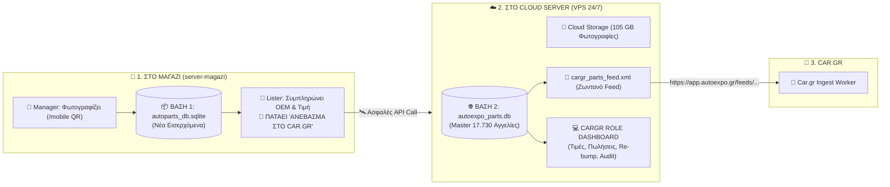

# 🚀 Autoexpo Car.gr Pipeline & XML Feed Integration
**Ολοκληρωμένη Τεχνική Τεκμηρίωση, Προδιαγραφές & Πλάνο Υλοποίησης**

---

## 1. 📌 Επισκόπηση Έργου (Executive Summary)

Το σύστημα **Autoexpo Car.gr Pipeline** προσφέρει **πλήρη ανεξαρτησία, αυτοματοποίηση και αμφίδρομο συγχρονισμό** του αποθέματος ανταλλακτικών της εταιρείας **Autoexpo** με την πλατφόρμα του **Car.gr** μέσω του επίσημου προτύπου **XML Feed (`xyma-parts`)** και τοπικής βάσης δεδομένων.

### 📊 Βασικά Μεγέθη Καταλόγου:
- **Συνολικές Αγγελίες:** `17.730`
- **Πληρότητα Περιγραφών:** `100.0%` (0 κομμένα κείμενα)
- **Αποθηκευμένες Φωτογραφίες Τοπικά:** `525.290` αρχεία High-Res (`105.65 GB`)
- **Μοναδικότητα Δεδομένων:** `100% Zero-Duplicates` (17.730 μοναδικά IDs)
- **Εγκυρότητα XML Feed:** `100% Validated` από τον Επίσημο Ελεγκτή του Car.gr
- **Έλεγχος Ακεραιότητας (Audit):** `20 / 20 Tests Passed (100.0%)`

---

## 2. 🏗️ Συνολική Υβριδική Αρχιτεκτονική (Shop Server ➡️ Cloud Server ➡️ Car.gr)



---

## 3. 👥 Οι 3 Ακριβείς Ρόλοι του Συστήματος

| Ρόλος | Πού δουλεύει; | Τι κάνει στην εφαρμογή; |
| :--- | :--- | :--- |
| **1. `manager`** | **Στο Μαγαζί (`server-magazi`)** | • Φωτογραφίζει τα ανταλλακτικά (μέσω `/mobile` QR στο κινητό απευθείας στο ράφι).<br>• Οργανώνει τους φακέλους και τις φωτογραφίες στην τοπική Βάση 1 (`autoparts_db.sqlite`). |
| **2. `lister`** | **Στο Μαγαζί (`server-magazi`)** | • Βλέπει τις φωτογραφίες που οργάνωσε ο Manager.<br>• Χρησιμοποιεί OCR για OEM κωδικούς, επιλέγει Μάρκα, Μοντέλο, Έτη, Τιμή.<br>• **Πατάει `[🚀 Ανέβασμα στο Car.gr]`**: Εγκρίνει και στέλνει τα στοιχεία στο Cloud! |
| **3. `cargr`** | **Στον Cloud Server** | • **Το Κεντρικό Dashboard για το XML Feed (17.730+ αγγελίες)**.<br>• **`[✏️ Αλλαγή Τιμής]`**, **`[✅ Πουλήθηκε / Διαγραφή]`**, **`[⚡ Re-bump σε 1η Σελίδα]`**.<br>• Κέντρο Συγχρονισμού & **20-Point Audit Tool**. |

---

## 4. 🌐 Τεχνικές Προδιαγραφές Car.gr XML Feed (`xyma-parts`)

| Πεδίο XML | Τύπος | Υποχρεωτικό | Περιγραφή & Κανόνας Εγκυρότητας |
| :--- | :--- | :---: | :--- |
| `<lastupdate>` | ISO 8601 UTC | **ΝΑΙ** | Ημερομηνία και ώρα παραγωγής του αρχείου (π.χ. `2026-08-19T18:03:49Z`). |
| `<unique_id>` | String | **ΝΑΙ** | **Ο Εσωτερικός Κωδικός Καταστήματος**. Αντιστοιχίζεται 1-προς-1 για αποφυγή διπλότυπων. |
| `<title>` | String (<=200) | **ΝΑΙ** | Τίτλος του ανταλλακτικού με αυτόματο XML escaping (`&` -> `&amp;`, `<` -> `&lt;`). |
| `<description>` | Text (<=6000) | **ΝΑΙ** | Πλήρης περιγραφή του ανταλλακτικού (100% ολοκληρωμένο κείμενο). |
| `<category_id>` | Integer | **ΝΑΙ** | **Αυστηρά 1 leaf ID κατηγορίας** από τις 1.011 επίσημες κατηγορίες Αυτοκινήτου του Car.gr. |
| `<price>` | Decimal | **ΝΑΙ** | Τιμή σε Ευρώ με 2 δεκαδικά (π.χ. `120.00`). |
| `<product_make>` | String | Όχι | Μάρκα προϊόντος (π.χ. `Ford`, `Toyota`, `Volkswagen`). |
| `<product_model>` | String | Όχι | Μοντέλο προϊόντος (π.χ. `PUMA`, `GOLF`, `YARIS`). |
| `<makemodels>` | Tree | Όχι | Συμβατά οχήματα με `<make>`, `<model>`, `<yearfrom>`, `<yearto>`. |
| `<condition>` | Enum | **ΝΑΙ** | `used` (Μεταχειρισμένο) ή `new` (Καινούργιο). |
| `<condition_type>`| String | Όχι | `Γνήσιο`, `Ιμιτασιόν`, `Ανακατασκευή`. |
| `<debatable>` | Boolean | **ΝΑΙ** | Αυστηρά `false` (Μη συζητήσιμη τιμή). |
| `<photos>` | Tree | **ΝΑΙ** | Λίστα πλήρων High-Res URLs των φωτογραφιών του ανταλλακτικού. |

---

## 5. 💻 Εντολές Χρήσης (CLI Reference)

```powershell
# 1. Εξονυχιστικός Έλεγχος Ακεραιότητας 20 Σημείων (Validation Audit)
python main.py audit

# 2. Παραγωγή Επίσημου Car.gr XML Feed (17.730 αγγελίες)
python main.py export-xml

# 3. Επικύρωση Εγκυρότητας XML Feed
python main.py validate-xml

# 4. Εκκίνηση Τοπικού Web Dashboard (Viewer & Inventory Manager)
python main.py viewer --port 8088

# 5. Έλεγχος Στατιστικών Καταλόγου
python main.py stats
```

---

## 6. 📅 Χρονοδιάγραμμα Υλοποίησης Επόμενης Φάσης (Estimated Roadmap)

> **Συνολική Εκτίμηση: 1 έως 2 Ημέρες Εργασίας Συνολικά**  
*(Το 80% του δύσκολου έργου —βάση δεδομένων, 105 GB φωτογραφίες, XML generation, 20/20 audit— έχει ήδη ολοκληρωθεί).*

| Φάση | Αντικείμενο Εργασίας | Εκτιμώμενος Χρόνος |
| :--- | :--- | :---: |
| **Φάση 1 (Μαγαζί)** | **Shop Server Ingest & Lister 1-Click Upload Engine:**<br>• Ενσωμάτωση του κουμπιού «🚀 Ανέβασμα στο Car.gr» στην οθόνη του Lister στο `Autoexpo_parts_manager`.<br>• Ασφαλής αποστολή δεδομένων και φωτογραφιών στο Cloud API. | **Ημέρα 1** |
| **Φάση 2 (Cloud)** | **Cloud Server API & Car.gr XML Hub:**<br>• Υποδοχή νέων ανταλλακτικών στη Master Βάση (`autoexpo_parts.db`).<br>• Αυτόματη ανανέωση του `cargr_parts_feed.xml` στο δευτερόλεπτο.<br>• Dashboard ρόλου `cargr` (Τιμές, Πωλήσεις, Re-bump, 20/20 Audit). | **Ημέρα 2** |

---

## 7. 🛡️ Αποτελέσματα Ελέγχου Ακεραιότητας (Audit 20/20 Passed)

```
===========================================================================
🛡️  ΕΞΟΝΥΧΙΣΤΙΚΟΣ ΕΛΕΓΧΟΣ ΑΚΕΡΑΙΟΤΗΤΑΣ & ΕΓΚΥΡΟΤΗΤΑΣ (FULL AUDIT)
===========================================================================
📦 [1/4] ΒΑΣΗ ΔΕΔΟΜΕΝΩΝ: 17.730 / 17.730 Αγγελίες, 0 Duplicates, 0 Κομμένα Κείμενα
🖼️ [2/4] ΦΩΤΟΓΡΑΦΙΕΣ:   525.290 Αρχεία (105.65 GB), 100% Κάλυψη
🌐 [3/4] XML FEED:      56.22 MB, 17.730 Classifieds, 100% Car.gr Validated
📊 [4/4] EXCEL CSV:     41.75 MB, 24.014 Γραμμές
===========================================================================
🟢 ΕΠΙΤΥΧΙΑ: 20 / 20 ΕΛΕΓΧΟΙ (100.0% VALIDATION SCORE)
```
