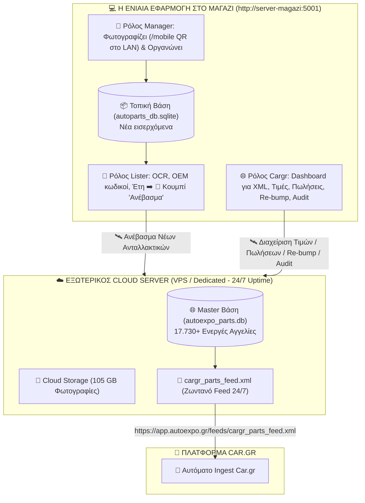

# 🏛️ Ενοποιημένη Αρχιτεκτονική: ΜΙΑ Τοπική Εφαρμογή (Shop Server) ➡️ Cloud Storage & XML Feed
**Πώς η τοπική εφαρμογή στο μαγαζί (`server-magazi:5001`) διαχειρίζεται και τους 3 ρόλους και τον εξωτερικό Cloud Server**

---

## 1. 🎯 Η Κεντρική Φιλοσοφία (Single Local App Hub)

Όλοι οι χρήστες στο κατάστημα (Manager, Lister, Cargr Role) χρησιμοποιούν **ΜΙΑ ΜΟΝΟ ΕΦΑΡΜΟΓΗ** που τρέχει τοπικά στον server του μαγαζιού (`http://server-magazi:5001`):

---

## 2. 👥 Οι 3 Ρόλοι Μέσα στην Ίδια Τοπική Εφαρμογή:

Όλοι συνδέονται στο **`http://server-magazi:5001`** και επιλέγουν τον ρόλο τους:

### 1️⃣ Ρόλος `manager` (Φωτογράφιση & Οργάνωση):
- Συνδέεται από το κινητό του μέσω **QR Code (`/mobile`)** απευθείας στο ράφι.
- Φωτογραφίζει, οργανώνει τους φακέλους και καταχωρεί τα νέα ανταλλακτικά στην τοπική βάση (`autoparts_db.sqlite`).

### 2️⃣ Ρόλος `lister` (Έλεγχος, Τιμολόγηση & Έγκριση):
- Συνδέεται από το PC του στην τοπική εφαρμογή.
- Βλέπει τις νέες φωτογραφίες του Manager, χρησιμοποιεί OCR για κωδικούς OEM, επιλέγει μάρκα/μοντέλο/έτος και τιμή.
- **Πατάει το κουμπί: `[🚀 Ανέβασμα στο Car.gr]`**:
  - Η τοπική εφαρμογή στέλνει αυτόματα τα στοιχεία και τις φωτογραφίες στον Cloud Server.
  - Ενημερώνεται άμεσα το `cargr_parts_feed.xml`!

### 3️⃣ Ρόλος `cargr` (Το Car.gr & XML Dashboard μέσα στην Εφαρμογή):
- Συνδέεται από το PC του στην τοπική εφαρμογή.
- **Βλέπει και διαχειρίζεται απευθείας τη Master Βάση και το XML Feed του Cloud Server:**
  - **`[✏️ Αλλαγή Τιμών]`**: Αλλάζει τιμές στα 17.730 ανταλλακτικά και ενημερώνει το Cloud XML.
  - **`[✅ Πουλήθηκε / Διαγραφή]`**: Αφαιρεί πουλημένα ανταλλακτικά από το Cloud XML Feed.
  - **`[⚡ Re-bump]`**: Στέλνει εντολή ανανέωσης για άνοδο αγγελιών στην 1η σελίδα του Car.gr.
  - **`[🛡️ 20-Point Audit]`**: Εκτελεί τον πλήρη έλεγχο ακεραιότητας μέσα από το γραφικό περιβάλλον!

---

## 3. 💎 Γιατί Αυτό είναι το Ιδανικό Μοντέλο για Εσάς:

1. **ΜΙΑ Μόνο Εφαρμογή για Όλους:**  
   Δεν χρειάζεται να ανοίγετε διαφορετικά προγράμματα. Όλο το μαγαζί δουλεύει στο `http://server-magazi:5001`.
2. **Μηδενικό Μπέρδεμα:**  
   Κάθε εργαζόμενος βλέπει ακριβώς την οθόνη που του αναλογεί βάσει του ρόλου του.
3. **Ο Cloud Server δουλεύει αθόρυβα στο παρασκήνιο:**  
   Η τοπική εφαρμογή επικοινωνεί αυτόματα με τον Cloud Server για το ανέβασμα φωτογραφιών, την ανανέωση του XML και το σερβίρισμα στο Car.gr 24/7!
