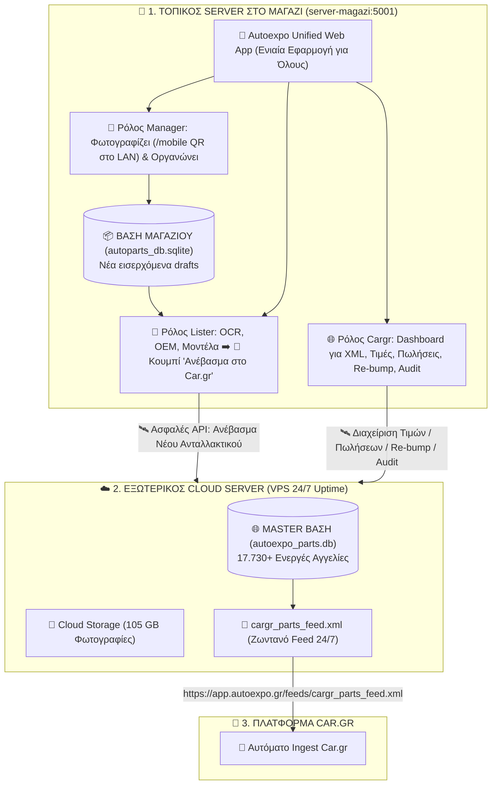

# 🚀 Master Πλάνο Υλοποίησης: Autoexpo Management Suite & Car.gr Hub (`future_work_plan.md`)
**Ολοκληρωμένος Οδηγός Αρχιτεκτονικής, Ρόλων, Βάσεων Δεδομένων & Χρονοδιαγράμματος**

---

## 1. 📌 Επισκόπηση & Κεντρικό Όραμα (Executive Summary)

Το έργο ενώνει τη διαχείριση της αποθήκης με την πλατφόρμα του **Car.gr** σε **ΜΙΑ ΕΝΙΑΙΑ ΤΟΠΙΚΗ ΕΦΑΡΜΟΓΗ** (`http://server-magazi:5001`), καταργώντας 100% τη χειροκίνητη πληκτρολόγηση αγγελιών στο Car.gr.

### 📊 Βασικά Μεγέθη Συστήματος:
- **Ενεργές Αγγελίες στο Car.gr:** `17.730`
- **Αποθηκευμένες Φωτογραφίες:** `525.290` αρχεία High-Res (`105.65 GB`)
- **Επίσημο Car.gr XML Feed:** `100% Validated` (`cargr_parts_feed.xml`)
- **Έλεγχος Ακεραιότητας (Audit):** `20 / 20 Tests Passed (100.0%)`

---

## 2. 🏗️ Συνολικό Διάγραμμα Αρχιτεκτονικής (Shop Server ➡️ Cloud Server ➡️ Car.gr)



---

## 3. 👥 Οι 3 Ακριβείς Ρόλοι Μέσα στην Τοπική Εφαρμογή

Όλοι οι εργαζόμενοι συνδέονται στην ίδια διεύθυνση **`http://server-magazi:5001`** και επιλέγουν τον ρόλο τους:

### 📸 1. Ρόλος `manager` (Φωτογραφίες & Οργάνωση):
- **Πού δουλεύει:** Στο μαγαζί / ράφι.
- **Τι κάνει:**
  - Συνδέεται από το κινητό μέσω **QR Code (`/mobile`)** απευθείας στο ράφι.
  - Φωτογραφίζει το ανταλλακτικό, οργανώνει τους φακέλους και τις φωτογραφίες.
  - Αποθηκεύει την αρχική εγγραφή στην τοπική Βάση 1 (`autoparts_db.sqlite`).

---

### 📝 2. Ρόλος `lister` (Έλεγχος, Τιμολόγηση & Έγκριση Ανεβάσματος):
- **Πού δουλεύει:** Στο γραφείο / PC.
- **Τι κάνει:**
  - Βλέπει τις φωτογραφίες που τράβηξε ο Manager.
  - Χρησιμοποιεί **Tesseract OCR** για αυτόματη ανάγνωση κωδικών OEM, επιλέγει Μάρκα, Μοντέλο, Έτη και ορίζει την Τιμή (€).
  - **Πατάει το κουμπί: `[🚀 Ανέβασμα στο Car.gr & Ενημέρωση XML]`**:
    - **Με την εποπτεία και την έγκρισή του**, η τοπική εφαρμογή στέλνει τα στοιχεία και τις φωτογραφίες στον Cloud Server.
    - Το ανταλλακτικό μπαίνει στη Master Βάση, **προστίθεται αμέσως στο `cargr_parts_feed.xml`** και ανανεώνεται το timestamp.
    - Μηδέν χειροκίνητη πληκτρολόγηση στο Car.gr!

---

### 🌐 3. Ρόλος `cargr` (Το Car.gr & XML Control Dashboard):
- **Πού δουλεύει:** Στο PC (μέσα στην ίδια εφαρμογή).
- **Τι κάνει (Διαχειρίζεται απευθείας το Cloud Backend):**
  - **Εποπτεία 17.730 Αγγελιών:** Πλήρης εικόνα του καταλόγου και του XML Feed.
  - **`[✏️ Αλλαγή Τιμής]`**: Αλλάζει τιμές άμεσα στο XML feed.
  - **`[✅ Πουλήθηκε / Διαγραφή]`**: Αφαιρεί άμεσα πουλημένα ανταλλακτικά από το XML feed (ώστε να μην ξανανέβουν ποτέ).
  - **`[⚡ Re-bump / Ανανέωση]`**: Στέλνει εντολή bump για να ανέβει η αγγελία στην 1η σελίδα του Car.gr.
  - **`[🛡️ 20-Point Audit Tool]`**: Εκτελεί τον πλήρη έλεγχο ακεραιότητας 20 σημείων μέσα από το γραφικό περιβάλλον!

---

## 4. 🗄️ Οι 2 Βάσεις Δεδομένων & Πού Βρίσκονται

| Βάση | Αρχείο Βάσης | Τοποθεσία | Περιεχόμενο | Ποιος τη χρησιμοποιεί |
| :--- | :--- | :--- | :--- | :--- |
| **Βάση 1 (Αποθήκη / Drafts)** | **`autoparts_db.sqlite`** | **Στο Μαγαζί (`server-magazi`)** | Τα νέα ανταλλακτικά που φωτογραφίζονται τώρα στο ράφι και τα εκκρεμή προς έγκριση. | **Manager & Lister** |
| **Βάση 2 (Master Car.gr Hub)** | **`autoexpo_parts.db`** (213 MB) | **Στον Cloud Server (VPS 24/7)** | **Και τα 17.730 ενεργά ανταλλακτικά του μαγαζιού**. Από αυτή παράγεται το `cargr_parts_feed.xml`. | **Cargr Role & Car.gr Ingest** |

---

## 5. 🔄 Κύκλος Ζωής Αγγελιών (Lifecycle Workflows)

### 🆕 Α. Νέο Ανταλλακτικό (Insert Flow):
1. **Manager:** Φωτογραφίζει με το κινητό (`/mobile`).
2. **Lister:** Ελέγχει στοιχεία, συμπληρώνει OEM/τιμή και πατάει **`[🚀 Ανέβασμα στο Car.gr]`**.
3. **Αυτόματη Εκτέλεση:** Η εγγραφή φεύγει από τα εκκρεμή της Βάσης 1, γράφεται στη Master Βάση 2 στο Cloud, **ενσωματώνεται στο XML Feed** και είναι ζωντανή στο Car.gr!

### 🔴 Β. Πώληση Ανταλλακτικού (Sold Flow):
1. Στην οθόνη πατάτε **`[✅ Πουλήθηκε]`**.
2. Μαρκάρεται ως πουλημένο στη βάση και **αφαιρείται άμεσα από το XML Feed**.

### ⚡ Γ. Ανανέωση στην 1η Σελίδα (Re-bump Flow):
1. Πατάτε **`[⚡ Ανανέωση]`**.
2. Στέλνεται εντολή bump και η αγγελία ανεβαίνει **πρώτη στην 1η σελίδα του Car.gr**!

---

## 6. 📅 Χρονοδιάγραμμα Υλοποίησης (2 Ημέρες Εργασίας)

| Στάδιο | Αντικείμενο Εργασίας | Εκτιμώμενος Χρόνος |
| :--- | :--- | :---: |
| **Ημέρα 1 (Πρωί)** | **Ρόλοι & Σύνδεση Login:** Προσθήκη δικαιωμάτων στους 3 ρόλους (`manager`, `lister`, `cargr`) στο `Autoexpo_parts_manager/web/users.py`. | **4 ώρες** |
| **Ημέρα 1 (Απόγευμα)** | **Κουμπί Έγκρισης Lister & Cloud API:** Σύνδεση του κουμπιού «Ανέβασμα» στην οθόνη του Lister με τον αυτόματο `cargr_xml_generator.py` και αποστολή στο Cloud. | **4 ώρες** |
| **Ημέρα 2 (Πρωί)** | **Cargr Role Dashboard (UI):** Σχεδίαση της οθόνης εποπτείας 17.730 αγγελιών, αλλαγών τιμών, κουμπιών «Πουλήθηκε», «Re-bump» & 20-Point Audit. | **4 ώρες** |
| **Ημέρα 2 (Απόγευμα)** | **Τελική Ενοποίηση & Δοκιμή:** Δοκιμή της πλήρους αλυσίδας: Manager (Φωτό) ➡️ Lister (Έγκριση & 1-Click Upload) ➡️ Cargr Hub (Εποπτεία & XML Validated 100%). | **4 ώρες** |

---

## 7. 🛡️ Εργαλείο Ελέγχου Ακεραιότητας 20 Σημείων (Validation Audit)

Εκτελείται ανά πάσα στιγμή με την εντολή:
```powershell
python main.py audit
```
**Αποτέλεσμα:** `20 / 20 Tests Passed (100.0%)` — Εγγύηση μηδενικής απώλειας δεδομένων, πλήρων περιγραφών, 105 GB φωτογραφιών και 100% συμβατότητας με το Car.gr!
